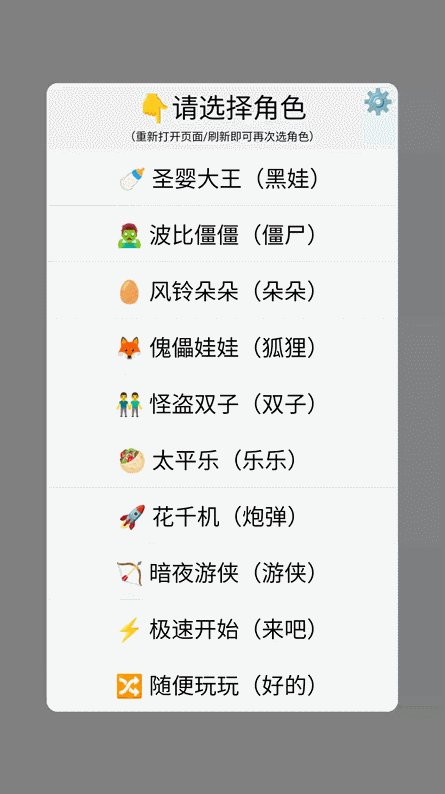

## 说明

`collide-try-vue` 是 `collide-try` 的 Vue 版本，主要区别在于 Vue 版本可以降级适配 ES5，兼容低版本浏览器。

其实主要用来模拟练习《玩吧-撞击王者》，游戏复盘、经验技巧交流。

 

1️⃣ 目前支持一个主打角色、三个辅助角色，主要适用于黑娃、僵僵、朵朵、傀儡、双子、太平乐等角色『角度』和『走位』练习

2️⃣ 血量条仅用来区分队伍，因为血量伤害体系很复杂，目前不考虑去实现

3️⃣ 角色运动速度和距离可能和实战有一定差距，做到一模一样很难

4️⃣ 可能存在个别角度（碰墙角）反弹有点问题，请以实战数据为准

5️⃣ 兼容手机、平板、电脑浏览器

 

## 预览

 

## 使用

- `npm run dev` 本地运行
- `npm run build` 编译打包

 
